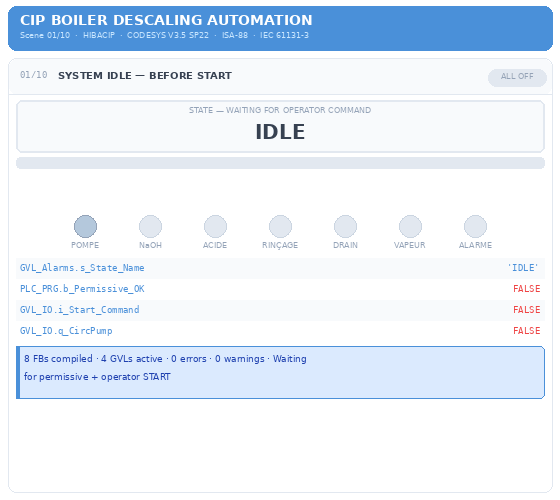
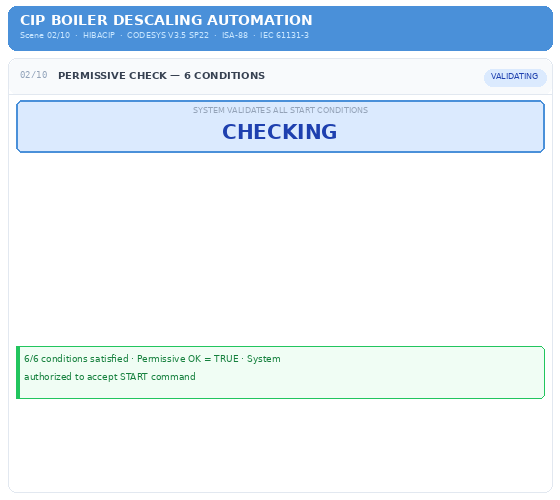
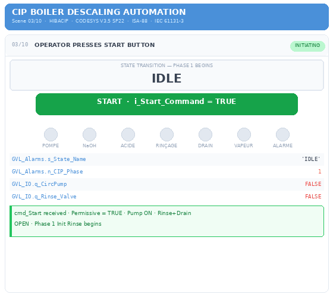
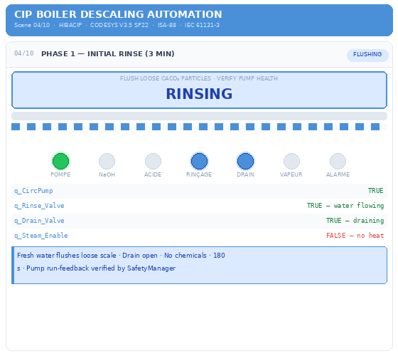
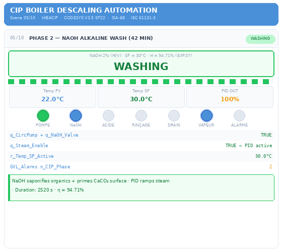
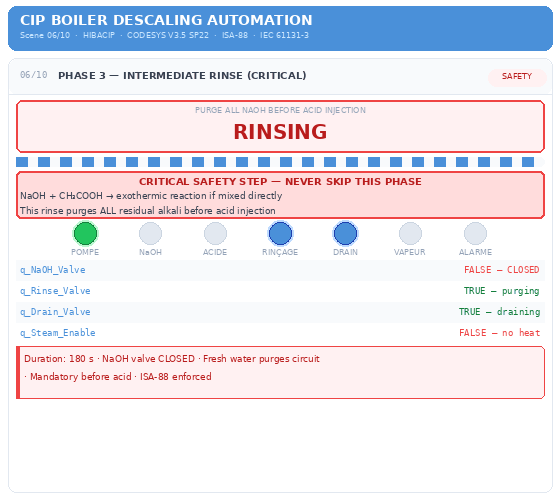
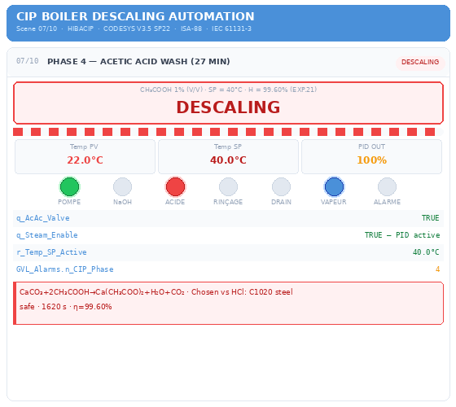
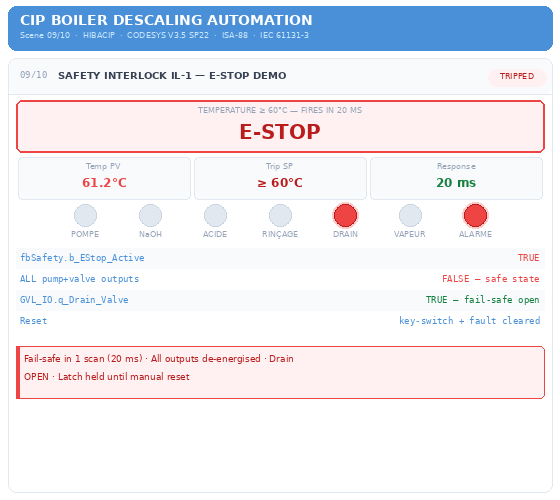
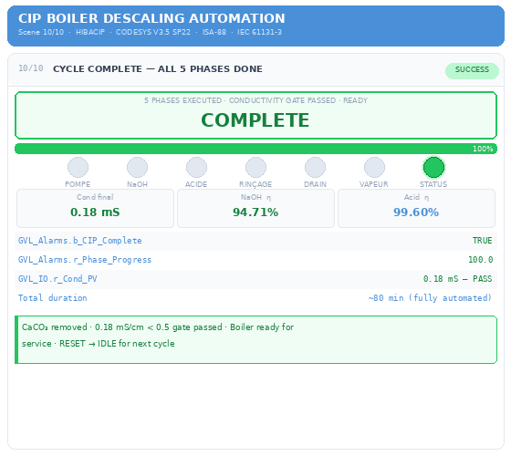

# CIP — CLEAN IN PLACE Boiler Descaling Automation

Automated Clean-In-Place (CIP) descaling system for industrial boilers,  
built in **CODESYS V3.5 SP22** following **ISA-88** and **IEC 61131-3** standards.  
Grounded in experimental research from **Université du 20 Août 1955, Skikda, Algeria**.

---

## Process Overview

|Phase| Name      | Duration | Chemical      | Efficiency |
|---|---|---|---|---|
| 1 | Initial Rinse | 3 min | Fresh water     | — |
| 2 | Alkaline Wash | 42 min | NaOH 2% @ 30°C | η = 94.71% |
| 3 | Safety Rinse | 3 min | Fresh water       | — |
| 4 | Acid Wash    | 27 min | CH₃COOH 1% @ 40°C | η = 99.60% |
| 5 | Final Rinse | 5 min | Fresh water + Cond gate ≤ 0.5 mS/cm | — |

**Total cycle: ~80 min · Fully automated · Zero chemical exposure**

---

## What's Inside

| File              | Description |
|---|---|
| `CIP.project` | Complete CODESYS V3.5 SP22 project |
| `CIP_PID_001.dxf` | P&ID drawing — AutoCAD Plant 3D 2024 |
| `CIP_Digital_Twin.py` | Python process simulation (FOPDT + PID) |
| `CIP_Report.docx` | 25-page engineering report |
| `CIP.xml` | PLCopen TC6 XML for import |
| `GIFs/` | 10 animated phase demonstrations |

---

## CODESYS Architecture

- **8 Function Blocks:** FB_CIP · FB_PID_Industrial · FB_SafetyManager · FB_SensorDiag · FB_ValveControl · FB_PumpControl · FB_AlarmManager · FB_RecipeManager  
- **4 GVLs:** GVL_IO · GVL_Setpoints · GVL_Alarms · GVL_HMI  
- **ISA-88 State Machine:** 15 states including HOLD / RESTART / ABORT  
- **PID Control:** Back-calculation anti-windup · Derivative on PV · Bumpless transfer  
- **Safety:** 3 interlocks (Temperature / Pressure / Flow) · Fail-safe outputs · 20 ms response

---

## How to Open in CODESYS

1. Install **CODESYS V3.5 SP22** and **CODESYS Control Win V3**
2. File → Open → select `CIP.project`
3. Start CODESYS Control Win from system tray
4. Press **Ctrl+L** then **F5**
5. Open **Surveillance 1** and set `GVL_IO.i_Start_Command = TRUE`

---

## Experimental Basis

Built upon chemical calculationss of: **Boumeghiti, Bekkouche & Dr. Boussaha (2021)**  
Université du 20 Août 1955, Skikda — Doehlert design, 21 experimental runs

---

## Author

**Hibaterrahmane budjelele** — Master's in Petrochemical Automation & Control Engineering  
Université du 20 Août 1955, Skikda, Algeria  

